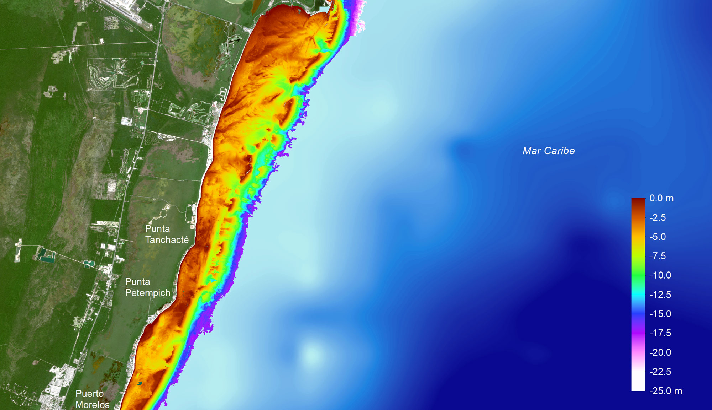
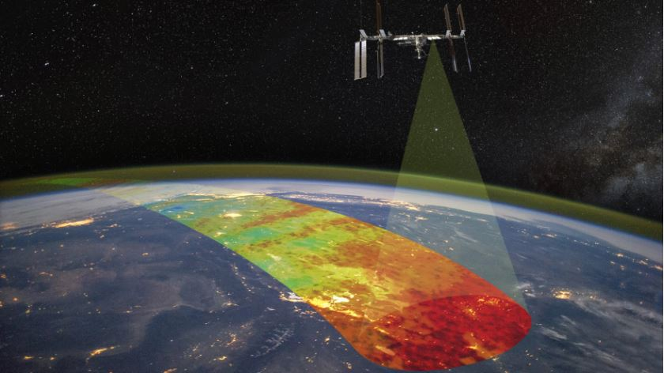

# **Teledetección Pasiva**

## **Batimetría Derivada por Satélite**

Desde la década de 1970 se realizaron gradualmente los primeros avances en estudios de aplicación de los sensores remotos ópticos para la estimación de la profundidad en aguas costeras (Deng et al. 2008); trabajos pioneros como los de (Polcyn et al. 1970; Lyzenga, 1978; Warne, 1978; Lyzenga, 1985; Philpot, 1989; Ibrahim & Cracknell, 1990) demostraron en gran medida atención por el uso de estas tecnologías en la aproximación de métodos para la estimación de la profundidad y su aplicación en varios campos de la ciencia.

La Batimetría Derivada por Satélite (SDB, por sus siglas en inglés) se presenta como una alternativa para la estimación de las profundidades en aguas costeras debido al potencial de los sensores remotos ópticos en capturar información de grandes extensiones de forma continua; en este contexto, la SDB permite caracterizar y monitorear en el tiempo, los cambios ocurridos en el fondo marino (Jagalingam et al. 2015; IHO-IOC, 2019). El uso de los Sistemas de Información Geográfica (SIG) y las técnicas de Teledetección se han vuelto de uso frecuente debido a la eficiencia y rentabilidad que representan para cartografiar batimetría en amplias zonas costeras (Gao, 2009; Putri et al. 2018); así mismo, la SDB representa un método novedoso que revoluciona el campo de la topografía hidrográfica.

La batimetría óptica está respaldada por el principio de que la cantidad total de energía radiativa reflejada a partir de una columna de agua está en función de la profundidad, el espectro de la banda azul y verde tienen gran capacidad de penetración del agua (Gao, 2009). Uno de los modelos más utilizados en el ámbito de la SDB es el desarrollado por (Stumpf et al. 2003); este método resalta una solución empírica mediante una relación matemática de reflectancia, el algoritmo establece la correspondencia lineal entre la reflectancia de dos bandas (azul y verde); a medida que aumenta la profundidad del agua, los valores de reflectancia de la banda con mayor absorción disminuirán proporcionalmente más rápido que el valor de reflectancia de la banda con menor absorción (Jagalingam et al. 2015).

La combinación de SDB y las infraestructuras geoespaciales de sistemas de computación en la nube como *Google Earth Engine*, brindan la oportunidad de efectuar preprocesamientos, procesamientos y análisis espaciotemporales a gran escala, a partir de códigos que se desarrollan en lenguaje de programación *Java Script*, donde se pueden utilizar imágenes multiespectrales de misiones satelitales tales como Lansat-8 y Sentinel-2, que a través de la combinación de bandas espectrales, permite el monitoreo y estudio del entorno marino. 

[Ejemplo mapa de batimetría por satélite](https://simar.conabio.gob.mx/arrecifesam/)

## **Misiones satélitales para la adquisición de imágenes multiespectrales**

### **Sentinel 2**

Las imágenes multiespectrales Sentinel 2 son las que se obtienen mediante la misión Sentinel 2, que forma parte del programa Copernicus de la Unión Europea y la Agencia Espacial Europea. Esta misión está compuesta por dos satélites idénticos, Sentinel 2A y Sentinel 2B, que orbitan a unos 786 km de altura y cubren toda la superficie terrestre cada cinco días.

Estos satélites llevan a bordo un sensor óptico llamado MSI (MultiSpectral Instrument), que captura imágenes en 13 bandas espectrales que abarcan desde el visible hasta el infrarrojo de onda corta, con resoluciones espaciales de 10, 20 y 60 metros. 

### **Lansat 8**

Las imágenes multiespectrales Landsat 8 son las que se obtienen mediante el satélite Landsat 8, que forma parte del programa Landsat de la NASA y el USGS. Este satélite fue lanzado en 2013 y continúa la serie de misiones Landsat que comenzaron en 1972. Su objetivo es proporcionar imágenes globales y continuas de la superficie terrestre para fines científicos, ambientales y de gestión de recursos.

El satélite Landsat 8 lleva a bordo dos sensores ópticos: el OLI (Operational Land Imager) y el TIRS (Thermal Infrared Sensor). El sensor OLI captura imágenes en nueve bandas espectrales que abarcan desde el visible hasta el infrarrojo de onda corta, con resoluciones espaciales de 15 y 30 metros. El sensor TIRS captura imágenes en dos bandas espectrales en el infrarrojo térmico, con una resolución espacial de 100 metros.

[Misión satélital](https://www.upr.org/utah-news/2021-01-13/space-dynamics-lab-in-logan-central-to-nasa-space-weather-research-project)

## **Referencias**

1. Deng, Z., Ji, M. & Zhang, Z. (2008). *Mapping bathymetry from multi-source remote sensing images: a case study in the beilun estuary, guangxi, China.* Int. Arch. Photogramm. Remote Sens. Spat. Inf. Sci., 37, 1321-1326. https://www.isprs.org/proceedings/XXXVII/congress/8_pdf/13_ThS-19/05.pdf

2. Gao, J. (2009). *Bathymetric mapping by means of remote sensing: Methods, accuracy and limitations.* Prog. Phys. Geogr., 33(1), 103-116. https://doi.org/10.1177/0309133309105657

3. Ibrahim, M. & Cracknell, A. P. (1990). *Cover Bathymetry using Landsat MSS data of Penang Island in Malaysia.* Int. J. Remote Sens., 11(4), 557-559. http://doi.org/10.1080/01431169008955040

4. IHO-IOC. International Hydrographic Organization - Intergovernmental Oceanographic Commission (2019). *The IHO-IOC GEBCO CookBook.* Francia: OHI Publication B-11, IOC Manuals and Guides 63. International Hydrographic Organization, Intergovernmental Oceanographic Commission. https://www.star.nesdis.noaa.gov/socd/lsa/GEBCO_Cookbook/

5. Jagalingam, P., Akshaya, B. J. & Hegde, A. V. (2015). *Bathymetry mapping using landsat 8 satellite imagery.* Procedia Eng., 116(1), 560-566. https://doi.org/10.1016/j.proeng.2015.08.326

6. Lyzenga, D. (1978). *Passive remote sensing techniques for mapping water depth and bottom features.* Appl. Opt., 17(3), 379-383. http://doi.org/10.1364/AO.17.000379

7. Lyzenga, D. (1985). *Shallow-water bathymetry using combined lidar and passive multispectral scanner data.* Int. J. Remote Sens., 6(1), 115-125. https://www.tandfonline.com/doi/abs/10.1080/01431168508948428

8. Philpot, W. (1989). *Bathymetric mapping with passive multispectral imagery.* Appl. Opt., 28(8), 1569-1578. http://doi.org/10.1364/AO.28.001569

9. Polcyn, F. C., Brown, W. L. & Sattinger, I. J. (1970). *The Measurement of Water Depth by Remote Sensing Techniques.* EE. UU.: The Institute of Science and Technology, The University of Michigan. https://pdfs.semanticscholar.org/59b2/a818598554825c7923bc3d51edd64d443f1d.pdf

10. Putri, J. C. A., Fuad, M. A. Z. & Asa´di, M. A. (2018). *Bathymetry mapping using Landsat 8 multyspectral data of bangsring coastal area.* Omni-Akuatika, 14(1), 54-61. https://doi.org/10.20884/1.oa.2018.14.1.368

11. Rocchio, L. E. P. (2016). *Avoiding Rock Bottom: How Landsat Aids Nautical Charting.* Landsat Sci., 71-77. https://landsat.gsfc.nasa.gov/wp-content/uploads/2016/08/Landsat_Improve_Life_Bathymetry.pdf

12. Stumpf, R. P., Holderied, K. & Sinclair, M. (2003). *Determination of water depth with high-resolution satellite imagery over variable bottom types.* Limnol. Oceanogr, 48, 54-556. https://doi.org/10.4319/lo.2003.48.1_part_2.0547

13. Warne, D. K. (1978). *Landsat as an Aid in the Preparation of Hydrographic Charts.* Photogramm Eng Remote Sensin., 44(8), 1011-1016.

